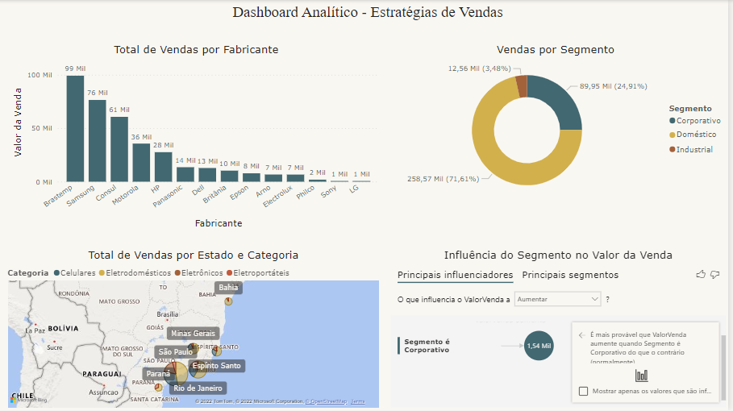
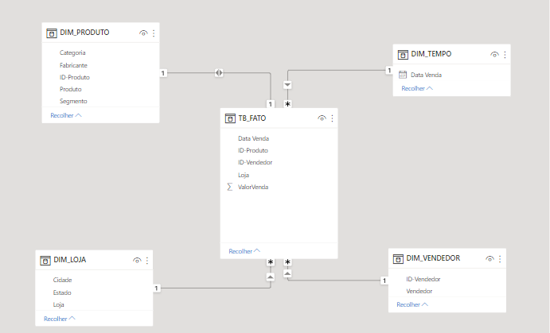

## Dashboard - Estratégias de Vendas - Exercício da DSA

### Este Dashboard foi criado para responder as seguintes perguntas:

- Qual dos fabricantes dos produtos vendidos, apresenta melhor desempenho nas vendas?

- Qual o total de vendas por estado e por categoria?

- Qual o total de vendas por segmento? 

- Qual segmento tem maior influência no valor médio de venda? 

### A imagem abaixo é referente ao modelo de dados criado para esse exercício a partir da fonte de dados => Vendas.xlsx

